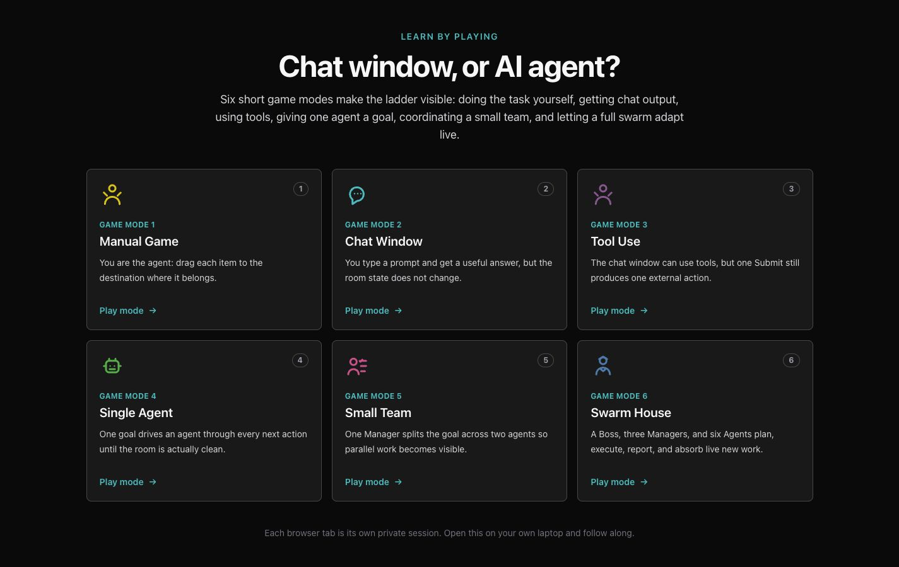
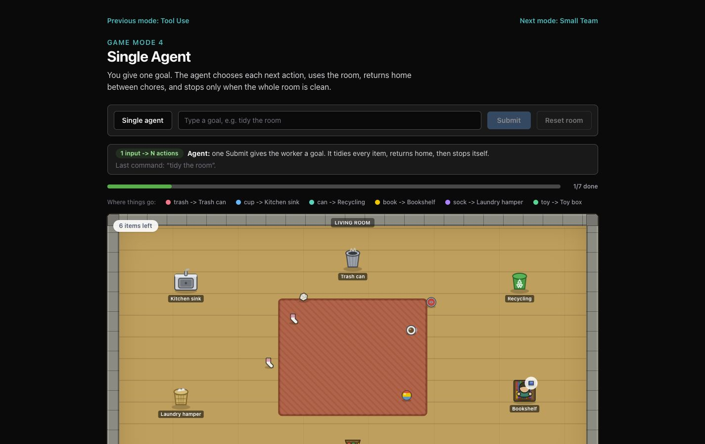
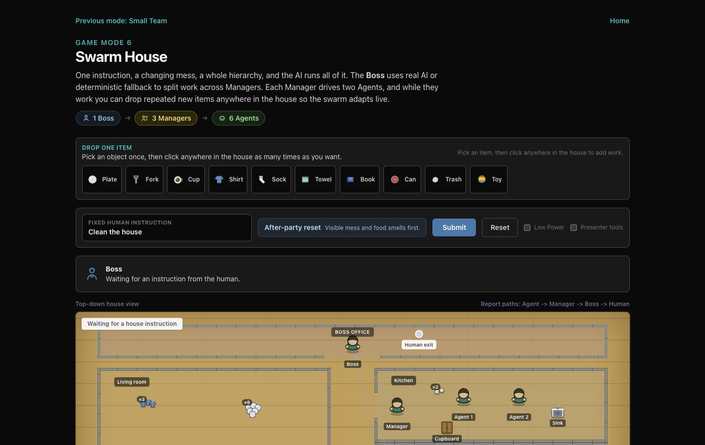
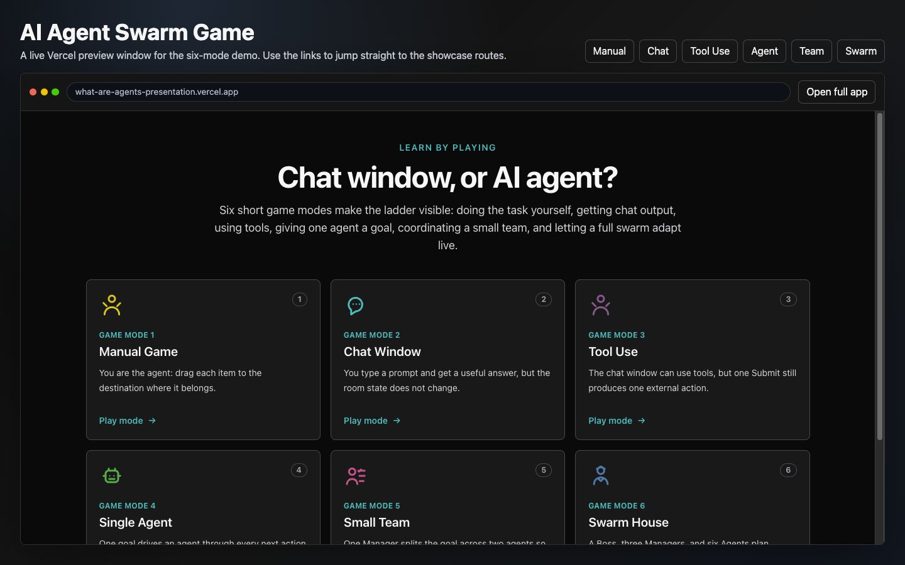

# AI Agent Swarm Game

A top-down **game** that teaches the difference between a chat window and an
**AI agent**: you give one instruction, then watch the AI take the controls and
run the agents itself. Six game modes, one app. Drive it live, or let a
coworker open the URL and play on their own laptop — each browser tab is its own
isolated session (no database, no login, no shared state).

**Current release:** v2.1.0 (six-mode ladder, canvas sprite engine,
authoritative Boss planning, Manager queue planning, and live swarm item
spawning).

## Live demo

- **Public app:** <https://what-are-agents-presentation.vercel.app>
- **Vercel preview window:** <https://what-are-agents-presentation.vercel.app/demo-embed.html>

GitHub README pages do not render live iframes, so this README uses captured
screenshots and links to the Vercel-hosted preview window. The preview page
contains the working iframe-style window for the deployed app.

## Screenshots

| Six-mode landing | Single agent in motion |
| --- | --- |
|  |  |

| Swarm House |
| --- |
|  |

| Vercel preview window |
| --- |
|  |

## What v2.1 includes

- Six polished mini games: Manual Game, Chat Window, Tool Use, Single Agent,
  Small Team, and Swarm House.
- Raw `<canvas>` sprite engine for room, team, and swarm movement, with React
  used only for discrete state and panels.
- Generated PNG sprite assets committed under `public/assets/sprites/`.
- Server-side OpenAI Boss and Manager planning routes, each fallback-backed.
- Repeatable live item spawning in the swarm house.
- Full local verification coverage: lint, unit tests, build, E2E, and visual QA
  at laptop/projector sizes.

- **Game mode 1 — Manual Game (`/manual`):** You are the agent. Drag trash to
  the trash can, the cup to the sink, and the book to the bookshelf.
- **Game mode 2 — Chat Window (`/chat`):** You type a prompt and get a useful text
  answer, but the room state does not change.
- **Game mode 3 — Tool Use (`/tool-use`):** The chat window gets tools, but one
  Submit still produces one external tool action. The room is the work area,
  and each destination is a tool the chat can call.
- **Game mode 4 — Single Agent (`/agent`):** One goal drives an agent through every
  next action until the room is clean, then it stops itself.
- **Game mode 5 — Small Team (`/team`):** One Manager splits a goal across two
  Agents moving between one messy room on the left and one work room on the
  right.
- **Game mode 6 — Swarm House (`/swarm`):** A local mess scenario renders instantly,
  then a Boss uses real AI to **allocate** the fixed "Clean the house" goal
  across Managers. Each Manager uses a real/fallback plan to split work across
  two Agents. While the swarm is running, the player can select a palette item
  once, click anywhere in the house repeatedly, and keep adding matching live
  work without resetting the run.

## Rendering

The playable scenes draw their sprite layer on a raw HTML5 `<canvas>` engine
(`components/sprites/SpriteEngine.ts`): a `requestAnimationFrame` loop paints
rasterized PNG sprites, Y-sorted for top-down depth, with movement decoupled
from React (no per-frame re-renders). The PNGs are generated offline from the
SVG definitions by `scripts/rasterize-sprites.mjs` (`npm run sprites`, uses
`sharp`) into `public/assets/sprites/`. CSS room shells and DOM panels/overlays
(forms, logs, legends, aria-live regions) sit over the canvas, so accessibility
and the teaching chrome are preserved.

Teaching behavior is explicit: Manual Game = you move items yourself, Chat =
output only, Tool Use = one submit → one tool action, Agent = one submit → a
self-terminating loop, Team = delegated parallel work, Swarm = hierarchy plus
live adaptation.

## Tech stack

- Next.js (App Router, TypeScript)
- Tailwind CSS + a raw `<canvas>` sprite engine
- Serverless API route(s) that keep the OpenAI key server-side only
- Deploy target: Vercel

## The real AI

The model is **"AI plans, engine executes":** the AI makes the decisions and
deterministic client-side animation carries them out, so cost and latency stay
predictable for a live audience.

| Route                  | When it runs                          | What it does                                        |
| ---------------------- | ------------------------------------- | --------------------------------------------------- |
| `/api/boss-plan`       | On Submit in Swarm House (the centerpiece) | Asks the model to **authoritatively assign every mess group to a Manager** — this drives which crew does the work and balances load so nobody is idle — plus priority, rationale, and escalation notes. |
| `/api/manager-plan`    | After the Boss allocation in Swarm House    | Each Manager splits work across its own two Agents, with fallback and visible rebalance behavior. |

The final report is generated locally from the actual completed work. If an AI
call fails, times out, or returns malformed JSON, the route falls back to
deterministic assignments so the live game never visibly breaks. The failure is
logged to the server console only. A small badge on the Boss panel shows whether
the decision came from the live model (`real AI decision`) or the fallback
(`fallback decision`).

The API key is read from `process.env.OPENAI_API_KEY` **inside the API route
only** — it is never exposed to client-side code.

## Local development

```bash
npm install
cp .env.example .env.local   # then fill in OPENAI_API_KEY
npm run dev
```

Open <http://localhost:3000>.

`.env.local` variables:

- `OPENAI_API_KEY` — your OpenAI API key (required for the live AI plan;
  without it, the app runs entirely on the built-in fallbacks, which is fine for
  a dry run).
- `OPENAI_MODEL` — model used for the Boss planning call. Defaults to
  `gpt-5.4-mini` for live-demo speed and cost control.

All six game modes are fully functional locally via `npm run dev`.

## Testing

Unit tests cover the shared swarm planning rules. A real-browser end-to-end
smoke test drives all six game modes and checks the core behaviors (Manual Game
drag placement, Chat output leaves state unchanged, Tool Use = one tool action
per submit, Agent self-terminates, Small Team splits work across two Agents,
Manager plans, repeated live item spawning, final report accounting, and the jam
→ human-escalation exit point).
It uses Playwright.

```bash
npm run test:unit
npm run dev                       # terminal 1 — serves on :3000
npx playwright install chromium   # one-time, downloads the browser
npm run test:e2e                  # terminal 2
```

Point it at a different origin with `E2E_BASE`, e.g.
`E2E_BASE=http://localhost:3100 npm run test:e2e`. A clean `npm run lint` and
`npm run build` should also pass with no warnings.

## Deploy to Vercel

Deployment is intentionally a separate approval step. The current beta is live
at <https://what-are-agents-presentation.vercel.app> from
`codex/v2.1-five-scene-ladder`; future production redeploys should still be
explicitly requested.

1. Install the CLI and log in (one time):

   ```bash
   npm install -g vercel
   vercel login
   ```

2. From the project root, link and deploy a preview:

   ```bash
   vercel
   ```

3. Set the environment variables (these are **not** committed to the repo —
   `.env.example` only documents the names):

   ```bash
   vercel env add OPENAI_API_KEY production
   vercel env add OPENAI_MODEL production
   ```

   (Repeat for the `preview` environment if you want previews to use the live
   model too. You can also set these in the Vercel dashboard under
   **Project → Settings → Environment Variables**.)

4. Ship to production:

   ```bash
   vercel --prod
   ```

The result is a public URL reachable from any browser in the US or Mexico — no
VPN, no login required by default.

## Run-of-show (presenting the six-mode ladder)

**Before you start:** open the local or production URL, confirm the Boss panel
shows `real AI decision` after a test run when a key is configured, then Reset.

**Game mode 1 — Manual Game (~1 min)**

1. Go to `/manual`.
2. Drag the trash to the trash can, the cup to the sink, and the book to the
   bookshelf. Point out that you are acting as the agent.

**Game mode 2 — Chat Window (~1 min)**

1. Go to `/chat`. Submit the same prompt.
2. Read the plan, then point to the unchanged item counter: output is not action.

**Game mode 3 — Tool Use (~1 min)**

1. Go to `/tool-use`. Submit `tidy the room`.
2. Point out that the chat has tools now, but one submit still calls one
   tool action. The chat window has help, not autonomy.

**Game mode 4 — Single Agent (~2 min)**

1. Go to `/agent`. Submit `tidy the room` once.
2. Let the agent choose the next item, move it, return home, and repeat until
   "Room clean!" appears. This is the self-finishing loop.

**Game mode 5 — Small Team (~2 min)**

1. Go to `/team`. Submit once.
2. The Manager splits the house work across Agent A and Agent B. Watch them move
   from the messy left room into the right-side work room, then read the team
   report.

**Game mode 6 — Swarm House (~4 min)**

1. Go to `/swarm`. Note the facility map: Boss office, manager rooms, work
   cells, report paths, and escalation markers.
2. Click Submit. Pause on **"Boss is deciding…"** and the thought bubbles —
   *"The house is already messy; this is the one moment that's real AI. The Boss
   is assigning the work across Managers."*
3. Open the Boss decision dropdown. The per-manager assignments and rationale
   appear. Managers light up, Agents start clearing, and the review log fills —
   *"The Manager is auditing every item."*
4. Pick **Plate** from the item palette, then click anywhere in the house a few
   times. Each plate drops onto the floor, the Kitchen Manager adds it to a live
   Agent queue, and the swarm keeps moving without a reset or reselection.
5. Point out a Manager resolving or rebalancing work: *"A Manager can handle most problems
   without bothering anyone up the chain."*
6. **(Optional)** Tick **Presenter tools** and click a zone's **Jam** button
   while it's working. Walk the escalation: Agent → Manager → Boss → the red
   **Needs human input** banner. *"This is the real exit point — when the whole
   chain is stuck, a person steps in."* Click **Resolve** to continue.
7. When all zones report in, the Boss assembles the **final report** locally
   from what actually happened, including player-added work. Read it aloud to
   close.

**Reset** between runs with the Reset button. If the venue Wi-Fi is flaky, the
fallback keeps everything working — you'll just see the `fallback decision`
badge.

## Constraints / non-goals

- No database, no multiplayer sync — each tab is independent.
- AI calls follow "AI plans, engine executes": ~1 Boss call + 3 Manager calls
  per swarm run. Every call has a deterministic fallback.
- Fixed hierarchy: 1 Boss, 3 Managers, 6 Agents.
- Primary target is laptop + projector. Mobile is usable but not the focus.
- Low Power mode caps the canvas loop and device-pixel-ratio pressure for older
  or overloaded laptops.
- An optional shared `ACCESS_CODE` passcode gate is intentionally **out of
  scope**.

## Project structure

```
app/
  page.tsx                     Landing page (six-mode ladder)
  manual/page.tsx              Manual Game
  chat/page.tsx                Chat Window
  tool-use/page.tsx            Tool Use
  agent/page.tsx               Single Agent
  team/page.tsx                Small Team
  swarm/page.tsx               Swarm House
  room/page.tsx                Legacy redirect to /agent
  warehouse/page.tsx           Legacy redirect to /swarm
  api/boss-plan/route.ts       Real OpenAI call — authoritative Boss allocation (+ fallback)
  api/manager-plan/route.ts    Real OpenAI call — Manager queue split (+ fallback)
components/
  ManualDragGame.tsx           Manual drag-and-drop placement game
  RoomScene.tsx                Tool-use and single-agent logic + choreography
  ChatWindowScene.tsx          Prompt/output-only mode
  SmallTeamScene.tsx           One Manager + two Agents mode
  WarehouseScene.tsx           Swarm orchestration (drives the canvas engine)
  RoomSprites.tsx              SVG sprite definitions — source of truth for the rasterizer
  sprites/
    SpriteEngine.ts            Raw <canvas> + rAF engine (Y-sorted, React-decoupled)
    SpriteRenderer.tsx         Mounts the canvas, hands the engine to the scene
    spriteManifest.ts          Typed view over the generated PNG manifest
  ReportPanel.tsx              Manager / Boss audit log
  EscalationBanner.tsx         "Needs human input" exit point
lib/
  warehouseRules.ts            Palette routing, Manager fallback planning, rebalance helpers
scripts/
  rasterize-sprites.mjs        SVG -> PNG pipeline (npm run sprites, uses sharp)
public/assets/sprites/         Generated PNG sprites + sprites.manifest.json (committed)
.env.example                   Variable names only — no real values
```

Regenerate the sprite PNGs after changing the SVG definitions in
`components/RoomSprites.tsx`:

```bash
npm run sprites
```
