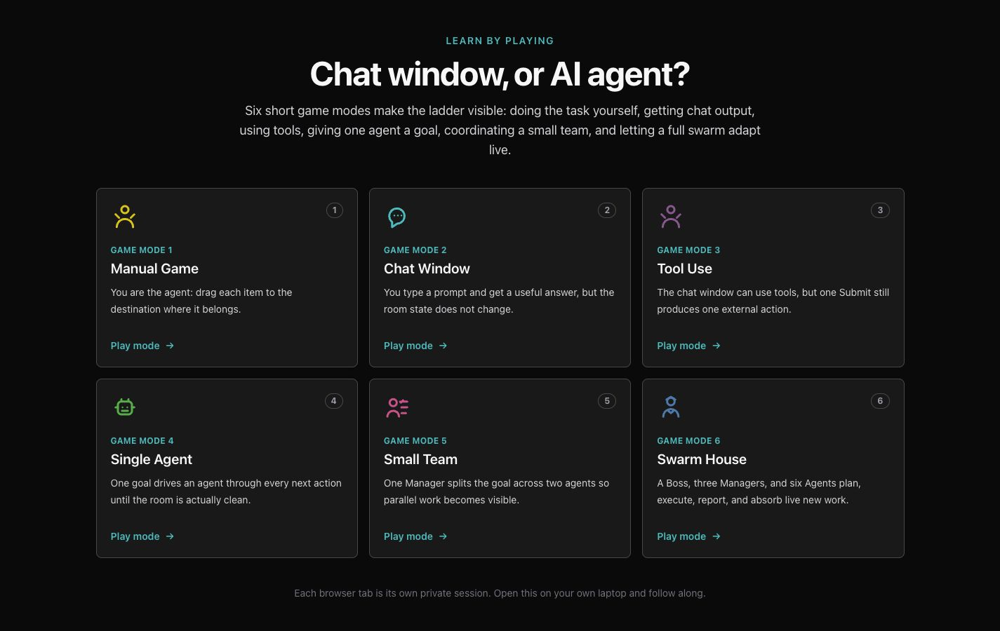
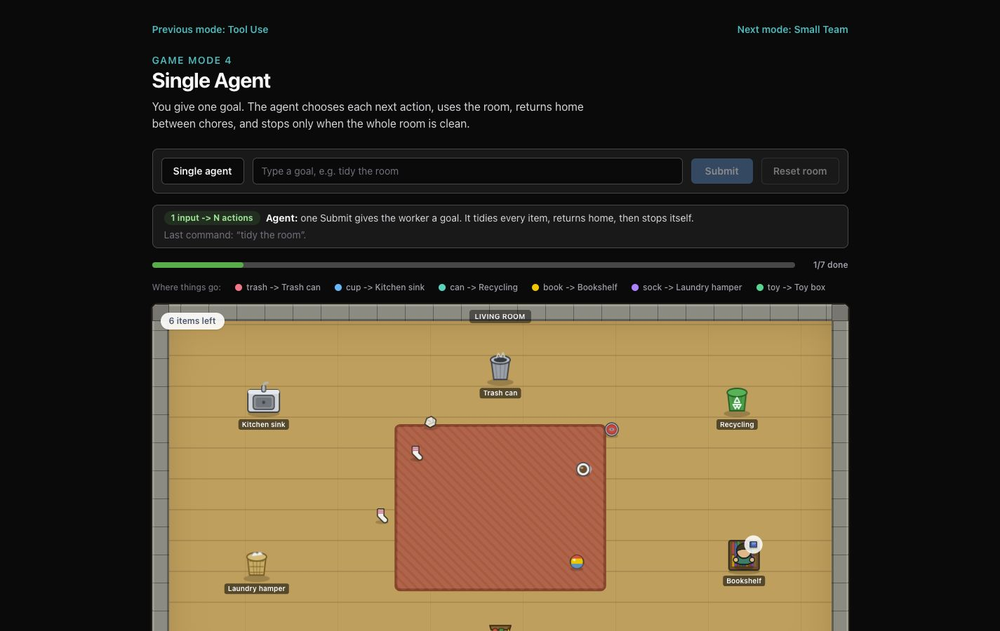
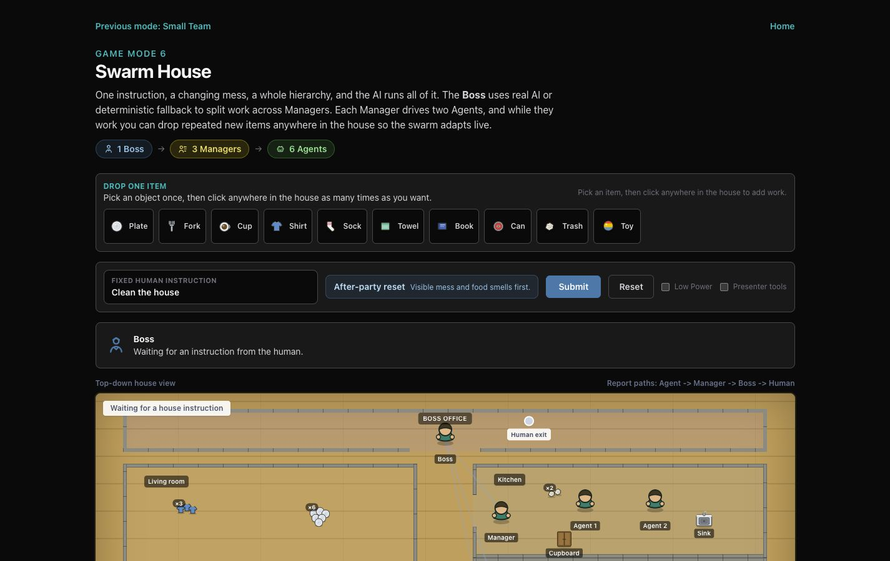
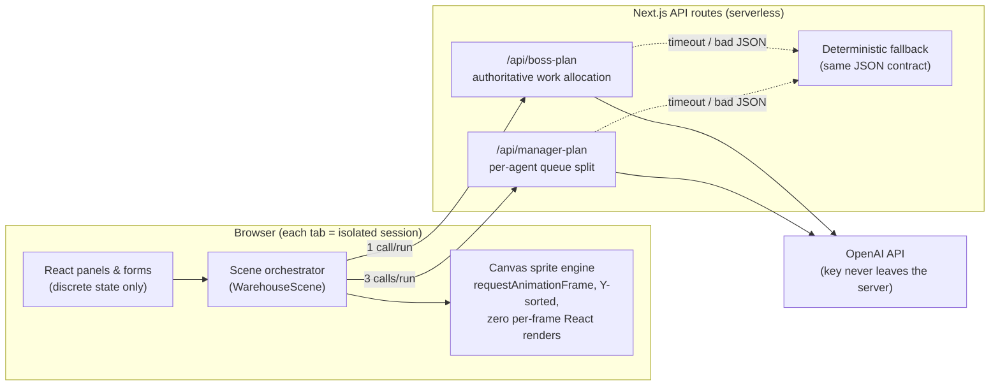

# AI Agent Swarm Game

[](https://nextjs.org)
[](https://www.typescriptlang.org)
[](https://tailwindcss.com)
[](tests/e2e.mjs)
[](https://what-are-agents-presentation.vercel.app)

**"What's the difference between a chatbot and an AI agent?"** Most people
can't answer that question — so this project answers it as a game. You give one
instruction, then watch the AI take the controls: first a chat window that can
only talk, then a single agent that finishes the job on its own, and finally a
full swarm — one AI Boss, three Managers, six Agents — that plans, delegates,
executes, self-corrects, and escalates to a human only when it's truly stuck.

Built to be presented live to a non-technical audience: every AI decision is
visible on screen, every run completes even if the network dies, and each
browser tab is its own isolated session — no database, no login, no setup.

## Live demo

- **Play it now:** <https://what-are-agents-presentation.vercel.app>
- **Framed preview window:** <https://what-are-agents-presentation.vercel.app/demo-embed.html>

## Screenshots

| Six-mode landing | Single agent in motion |
| --- | --- |
|  |  |

| Swarm House — the centerpiece |
| --- |
|  |

## The six-mode ladder

Each mode adds exactly one capability, so the audience feels the jump from
"software that answers" to "software that acts":

| # | Mode | Route | What it teaches |
|---|------|-------|-----------------|
| 1 | Manual Game | `/manual` | **You** are the agent — drag every item where it belongs yourself. |
| 2 | Chat Window | `/chat` | A prompt produces useful *text*, but the room doesn't change. Output ≠ action. |
| 3 | Tool Use | `/tool-use` | The chat gets tools, but one Submit still means one action. Help, not autonomy. |
| 4 | Single Agent | `/agent` | One goal drives a loop: pick task → act → check → repeat → **stop itself**. |
| 5 | Small Team | `/team` | A Manager splits one goal across two Agents — delegation and parallelism. |
| 6 | Swarm House | `/swarm` | A Boss uses **real AI** to allocate work across Managers; the swarm absorbs live new work you drop mid-run, and escalates to a human only when jammed. |

## Architecture: "AI plans, engine executes"

The design principle that makes this demo-safe: **the AI makes decisions; a
deterministic engine carries them out.** Model calls are bounded (~1 Boss + 3
Manager calls per swarm run), latency stays predictable, and a live audience
never watches a spinner.


```mermaid
flowchart LR
    subgraph Browser["Browser (each tab = isolated session)"]
        UI["React panels & forms<br/>(discrete state only)"]
        Engine["Canvas sprite engine<br/>requestAnimationFrame, Y-sorted,<br/>zero per-frame React renders"]
        Scene["Scene orchestrator<br/>(WarehouseScene)"]
        UI --> Scene --> Engine
    end
    subgraph Server["Next.js API routes (serverless)"]
        Boss["/api/boss-plan<br/>authoritative work allocation"]
        Mgr["/api/manager-plan<br/>per-agent queue split"]
        FB["Deterministic fallback<br/>(same JSON contract)"]
        Boss -.timeout / bad JSON.-> FB
        Mgr -.timeout / bad JSON.-> FB
    end
    OpenAI["OpenAI API<br/>(key never leaves the server)"]
    Scene -->|"1 call/run"| Boss
    Scene -->|"3 calls/run"| Mgr
    Boss --> OpenAI
    Mgr --> OpenAI
```

**Failure is a first-class path.** If a model call times out (8–12s budget),
returns malformed JSON, or the venue Wi-Fi dies, the route falls back to a
deterministic planner that honors the same contract — the show goes on, and a
small badge honestly reports `real AI decision` vs `fallback decision`. The
server also *normalizes* AI output: every mess group is assigned exactly once,
no Manager sits idle, and invalid or duplicate assignments are repaired before
they reach the client.

## Engineering highlights

- **Raw `<canvas>` sprite engine, decoupled from React**
  (`components/sprites/SpriteEngine.ts`): movement is mutated imperatively
  inside a `requestAnimationFrame` loop with Y-sorted top-down depth — React
  renders only on discrete events, never per frame. Includes a Low Power mode
  that caps frame rate and device-pixel-ratio for older laptops.
- **Bounded, resilient AI integration**: server-side routes validate input,
  race the model against a timeout, extract JSON defensively (including from
  markdown fences), normalize the plan against game rules, and always have a
  deterministic fallback. `OPENAI_API_KEY` is read inside the API route only.
- **Live adaptation**: while the swarm runs, the player drops new items
  anywhere in the house; the responsible Manager routes each one to its
  least-loaded Agent and the final report accounts for player-added work.
- **Human-in-the-loop escalation**: a presenter can jam any zone and walk the
  chain — Agent → Manager → Boss → "Needs human input" banner — the real exit
  point of an autonomous system.
- **Real verification pyramid**: unit tests on the shared planning rules, API
  contract probes (including malformed-JSON rejection), and a 48-check
  Playwright E2E suite that plays all six modes in a real browser — drag
  placement, loop self-termination, live item drops, escalation, and a
  zero-console-error gate.
- **Asset pipeline**: sprites are authored as SVG in one source-of-truth file
  and rasterized to PNG via `sharp` (`npm run sprites`), keeping the canvas
  fast and the art editable.

## Quick start

```bash
npm install
cp .env.example .env.local   # optional: add OPENAI_API_KEY for live AI
npm run dev                  # http://localhost:3000
```

Without a key the app runs entirely on the deterministic fallbacks — every mode
still completes. With a key, the Swarm House Boss and Managers plan with the
live model.

`.env.local` variables:

- `OPENAI_API_KEY` — enables live AI planning (optional).
- `OPENAI_MODEL` — Boss/Manager planning model, defaults to `gpt-5.4-mini`
  for live-demo speed and cost control.

## Testing

```bash
npm run lint
npm run test:unit                 # planning rules + sprite asset integrity
npm run build

npm run dev                       # terminal 1
npx playwright install chromium   # one-time
npm run test:e2e                  # terminal 2 — 48 checks across all six modes
```

Useful overrides: `E2E_BASE=http://localhost:3100` to point at another origin,
`E2E_CHROMIUM=/path/to/chromium` to use a pre-installed browser (CI/containers).

For a repeatable presenter-facing screen check at laptop and projector sizes:

```bash
E2E_BASE=http://localhost:3100 npm run test:walkthrough
```

Project execution uses the V2.3 control layer: [Taskboard](TASKBOARD.md) shows
active work, while stable specs hold requirements and verification proof. The
retired v2.1 tracker is preserved at
[`archive/ROADMAP-v2.1.md`](archive/ROADMAP-v2.1.md).

## Presenting this live

The full run-of-show — timing, talking points, executive Q&A prep, and a
pre-demo checklist — lives in **[PRESENTATION.md](PRESENTATION.md)**. The short
version: 6 modes, ~12 minutes, one instruction per mode, and the Swarm House
finale where the audience watches a real AI decision drive the workers.

## Deploy to Vercel

The current build is live at <https://what-are-agents-presentation.vercel.app>.
To deploy your own:

```bash
npm install -g vercel
vercel login
vercel                                    # link + preview
vercel env add OPENAI_API_KEY production  # names only in .env.example, never committed
vercel env add OPENAI_MODEL production
vercel --prod
```

## Project structure

```
app/
  page.tsx                     Landing page (six-mode ladder)
  manual|chat|tool-use|agent|team|swarm/   One route per game mode
  room|warehouse/              Legacy redirects
  api/boss-plan/route.ts       OpenAI call — authoritative Boss allocation (+ fallback)
  api/manager-plan/route.ts    OpenAI call — Manager queue split (+ fallback)
components/
  ManualDragGame.tsx           Drag-and-drop placement game
  ChatWindowScene.tsx          Prompt/output-only mode
  RoomScene.tsx                Tool-use + single-agent choreography
  SmallTeamScene.tsx           One Manager + two Agents
  WarehouseScene.tsx           Swarm orchestration (drives the canvas engine)
  RoomSprites.tsx              SVG sprite definitions — source of truth
  sprites/SpriteEngine.ts      Raw <canvas> + rAF engine (Y-sorted, React-decoupled)
lib/warehouseRules.ts          Palette routing, fallback planning, rebalance helpers
scripts/rasterize-sprites.mjs  SVG → PNG pipeline (npm run sprites)
tests/                         Unit tests + 48-check Playwright E2E suite
```

## Constraints / non-goals

- No database, no auth, no multiplayer — each tab is an independent session.
- Fixed hierarchy (1 Boss, 3 Managers, 6 Agents) and bounded AI calls per run.
- Primary target is laptop + projector; mobile is usable but not the focus.
